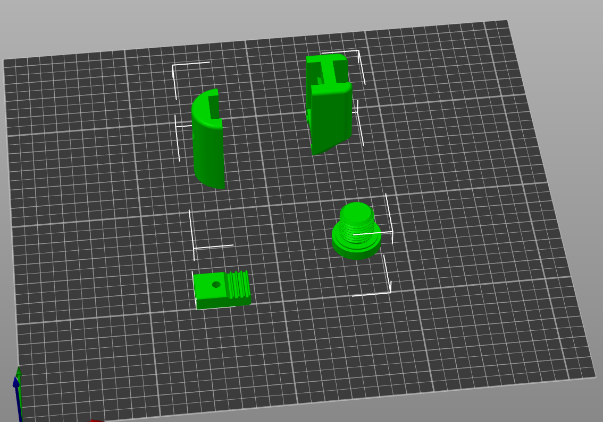
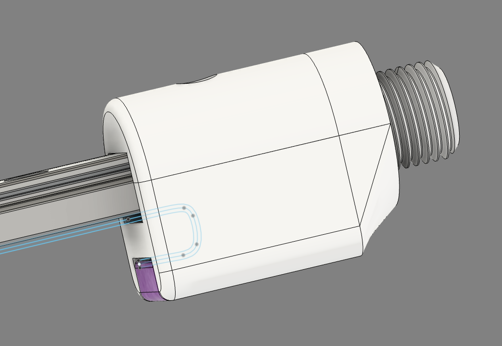
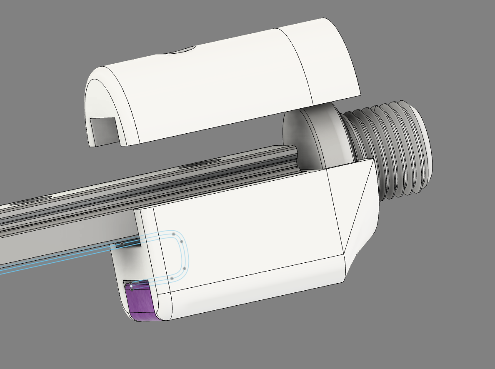
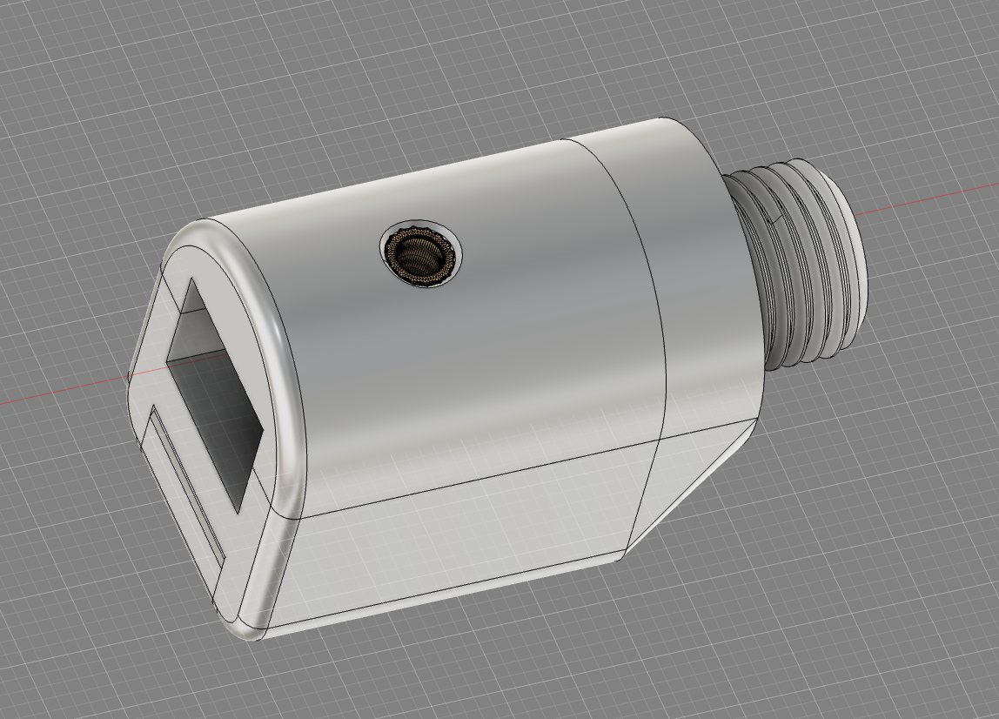
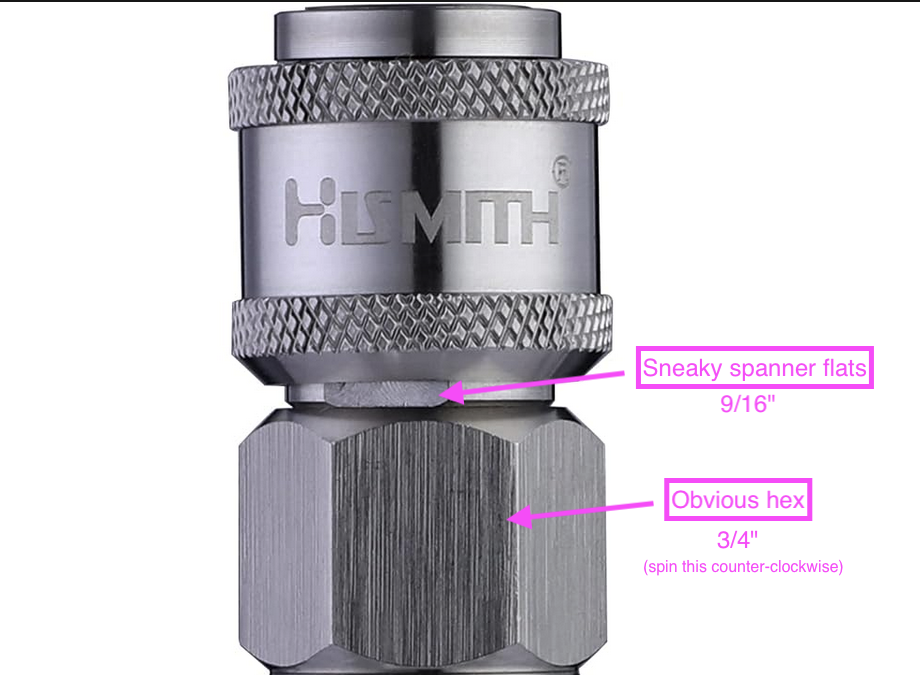
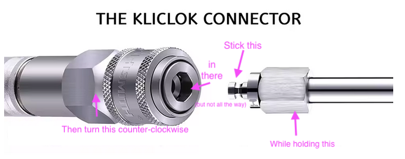

# Championship Edition Kliclok End Effector

## Print settings

- Tested with PLA+ @ 220C / 80mm default speed
- Slow and hot = strong parts
- 5 perimeters
- 5 solid top/bottom layers
- 0.2mm layer height
- larger first layer is fine
- whatever infill

## Parts

- 1/4" BSPP Port Plug
  - This part is available on [Grainger](https://www.grainger.com/product/PARKER-Hollow-Hex-Head-Plug-Carbon-39A352) (#39A352).
  - The printed threads are kind of insane though and should work for most purposes

- Kliclok (or Quick Air) fitting*

- M3x20mm bolt

- M3 washer (optional)

- M3 x 4mm x 5mm heat insert (Voron spec)

### STLs should load in the proper orientation, but please verify:

## Assembly

- Install the heat insert*

- Thread the belt through

- Position the port plug in one half. It should snap in

- Line everything up on the rail

- Snap the other half onto the port plug

- Run a M3x20mm through the printed parts and through the rail. An M3 washer is recommended, but optional

- Leave a tiny bit of belt sticking out to act as a bumper during homing

- Screw the Kliclok fitting on

### Heat Insert goes here

### Freeing the Kliclok Springyboi

#### Method A

Do the needful with a 9/16" cone wrench and a 3/4" wrench

#### Method B

Another way to separate this bad boy is to take a male Kliclok attachment, stick it partially* into the female end, then use a 3/4" wrench and an 11/16" wrench to spin it off (17mm and 19mm should also work)

NOTE: A spring and detent will go flying, but don't worry... that spring is only for the "shoots out on release" functionality--it doesn't affect the locking mechanism.

*Partially! If you go full lock the torque can seize the male end into the connector then you have to tighten everything back up to separate them and start the process all over

